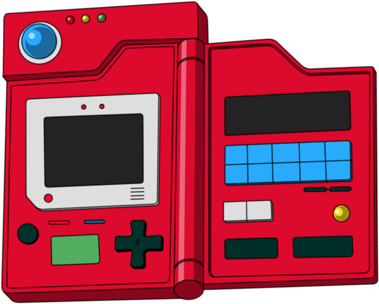

# Exercice: (html/css integration)

## Create this rendering

The goal is to create a gallery of images as followed: (on page gallery)

By any way you find appropriate

## Exercice Pokedex Code Quality (review)

On page Pokedex

A pokedex page is already coded, can you review it and identify any issues or areas for improvement. You can provide specific suggestions for how to fix or improve the code.

Write test cases for a given code snippet or function to ensure that it is working correctly and is robust against edge cases and unexpected input.

Explain the best practices or coding standards that should be followed when writing code, and how they can help improve the quality and maintainability of the codebase.

Overall, the goal of the code review exercise is to assess your abilities to write high-quality code, identify and fix issues, and follow best practices and coding standards.

Public API Rest:
https://pokeapi.co/api/v2/pokemon/?limit=20&offset=20

## Exercice algo / react

3 exercices. 2 to test some react concept, 1 to test algorithm

# Project Info:

# Launch the app

In the project directory, you can run:

### `pnpm start`

Runs the app in the development mode.\
Open [http://localhost:9000](http://localhost:9000) to view it in the browser.

## Available libraries / technologies:

- styled-components: https://styled-components.com/
- css/sass: https://sass-lang.com/
